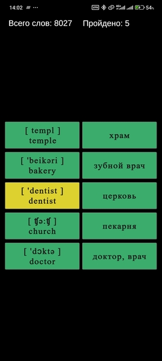

# 2DCollectCouple
## Скриншоты

**2DCollectCouple** — это игра  в которой игроку нужно находить пары слов на английском и русском языках
. Игра предназначена для тренировки словарного запаса и изучения иностранных слов в игровой форме.

## Основной функционал

- Отображение слов в двух колонках: английского слово в транскрипции с правописанием этого слова + русские переводы
- Подбор правильных пар слов
- Подсветка несовпадений
- Анимация исчезновения угаданных пар(в плане)
- Загрузка новых слов после успешного раунда
- Поддержка загрузки слов из JSON (в планах — из базы данных SQLite)
- Словарь нашел на просторах интернета на 8000 слов.
## Платформа

- Unity 6 (6000.1.2f1)
- Целевая платформа: можно собирать под любую платформу
  Экран сделан под мобильный телефон 1080x2400

## Статус

Актуальная версия: **2.7**

Функционал завершён:
- логика игры
- UI-кнопки
- события выбора пар.
- красивый шрифт (times new roman)

В планах:
- переход на базу данных (SQLite)
- фильтрация слов по сложности, времени, теме.
- сохранение прогресса

## Сборка

1. Открыть проект в Unity 6+
2. Построить через `Build Settings` → `Android`
3. Файл `.gitignore` исключает все временные и сборочные данные
4. Если проект открылся с пустой сценой то найти сцену и запустить вручную(проверил все работает)
## Контакты

Автор: [turioswin](https://github.com/turioswin)
